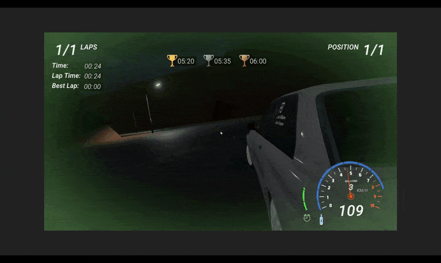

# 🎮 Save Titan

*Save Titan is a first-person shooter that combines fast-paced combat with parkour-inspired movement. Players can wall-run, slide, mantle, and shoot mid-air, creating fluid, high-mobility gameplay reminiscent of Titanfall. Designed for speed and momentum, every encounter is a test of agility, aim, and split-second decision-making.*

---

## 📑 Table of Contents

- [Project Description](#-project-description)  
- [Core Features](#-core-features)  
- [Feature Breakdown](#-feature-breakdown)  
- [Technology Used](#-technology-used)  
- [Developer Role](#-developer-role)  
- [Development Insights](#-development-insights)  
- [Lessons Learned](#-lessons-learned)  
- [Screenshots & Gameplay Preview](#%EF%B8%8F-screenshots--gameplay-preview)

---

## 📌 Project Description

**Save Titan** is a solo-developed first-person shooter created as a class project using **Unreal Engine 5 with C++ and Blueprints**. Inspired by the parkour system of *Titanfall*, the game emphasizes fluid movement and fast-paced action in a time trial format. Players must run, wall-run, slide, and mantle their way through a combat course—defeating enemies and racing against the clock to reach the finish line.

The game features **double jumping**, **wall running**, **sliding**, **mantling**, and **hit-scan-based shooting**, allowing players to chain parkour and gunplay seamlessly. While enemies remain stationary to keep the focus on movement mastery and precision, they do shoot back—adding a layer of pressure and timing to the trial.

All programming, UI, and design were done independently. Basic sound effects were implemented using Unreal’s built-in audio system, and **GitHub** was used for personal version control.

The technical highlight of the project lies in the character controller—built from scratch to replicate Titanfall-style parkour using **3D math**, **physics calculations**, and **custom movement logic**.

---

## 🎮 Gameplay GIF

  

---
